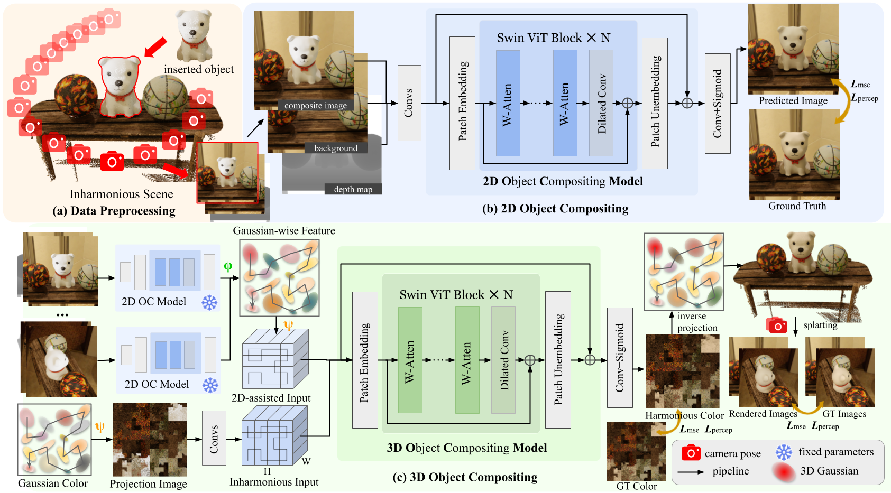

# MV-CoLight: Efficient Object Compositing with Consistent Lighting and Shadow Generation

[](https://city-super.github.io/mvcolight/)
[](https://arxiv.org/abs/2505.21483)
[](https://huggingface.co/cskrren/MV-CoLight)


[Kerui Ren](https://scholar.google.com.hk/citations?hl=zh-CN&user=5kW5apkAAAAJ&view_op=list_works&sortby=pubdate), [Jiayang Bai](https://scholar.google.com/citations?user=VmPQ6akAAAAJ&hl=zh-CN), [Linning Xu](https://eveneveno.github.io/lnxu),
[Lihan Jiang](https://jianglh-whu.github.io/), [Jiangmiao Pang](https://oceanpang.github.io/), [Mulin Yu<sup>†</sup>](https://scholar.google.com/citations?user=w0Od3hQAAAAJ), [Bo Dai<sup>†</sup>](https://daibo.info/) <br />

## News
**[2025.10.20]** We open-source the training and inference code, and release the pre-trained models.

**[2025.10.16]** We open-source the rendering code of [DTC-MultiLight](https://github.com/cskrren/DTC-MultiLight) dataset.

**[2025.09.25]** Our paper is accepted by NIPS 2025.

## Overview


**Overview of MV-CoLight.** (a) We insert **a white puppy** as the composite object onto the table between basketballs, and render multi-view **inharmonious images, background-only images**, and **depth maps** using a camera trajectory moving from distant to close-up positions. (b) We input a single-view data into the 2D object compositing model, which processes the data through multiple Swin Transformer blocks to output the harmonized result. (c) We project the multi-view features from 2D models into Gaussian space via $\Phi(\cdot)$, combine them with the original inharmonious Gaussian colors projected into 2D Gaussian color space through $\Psi(\cdot)$, and then feed them into the 3D object compositing model. The model outputs harmonized Gaussian colors and computes rendering loss by incorporating Gaussian shape attributes.

## Installation
Our code relies on Python 3.11.13, and is developed based on PyTorch 2.3.1 and CUDA 12.1, but it should work with other Pytorch/CUDA versions as well.

```bash
# 1. Clone MV-CoLight.
git clone https://github.com/InternRobotics/MV-CoLight.git --recursive
cd MV-CoLight

# 2. Create the environment, here we show an example using conda.
conda env create --file environment.yml
conda activate mvcolight
```

## Training

We train both 2D and 3D models on the **simple synthetic scene** of the DTC-MultiLight dataset. Due to storage limitations, we only provide one scene ([2D](https://drive.google.com/file/d/1c9YyhzUcDBKdJtXKkexjnNbrV0Hhylq9/view?usp=drive_link) and [3D](https://drive.google.com/file/d/1DC39wP9YW8r9YQCAyDZy_CqatQ2NcfSJ/view?usp=drive_link)) as reference. If you need the complete training data, please email me.
Before training, please download [imagenet-vgg-verydeep-19.mat](https://drive.google.com/file/d/1ESHUask5Hzhih1_XnXGV2xZz-ojoe013/view?usp=drive_link) to `./checkpoints`.

```
# Train 2D Object Compositing Model
torchrun --nnodes=$NUM_NODES --nproc_per_node=$GPU_NUM train.py --config ./configs/2d/dtc_multilight_2d.yml

# Train 3D Object Compositing Model
torchrun --nnodes=$NUM_NODES --nproc_per_node=$GPU_NUM train.py --config ./configs/3d/dtc_multilight_3d.yml
```

## Evaluation

We evaluate on the DTC-MultiLight dataset and two public datasets ([Objects With Lighting](https://arxiv.org/abs/2401.09126) and [FOSCom](https://arxiv.org/pdf/2308.10040)). We have provided the processed test data (DTC-MultiLight([2D](https://drive.google.com/file/d/1pnS7ZFTWwLavwDp4ZCVvJriQvetOtBmk/view?usp=drive_link), [3D](https://drive.google.com/file/d/1xVeBLFbhVgf_bA2C0kOUt-d9AM49nWqV/view?usp=drive_link)), Objects With Lighting([2D](https://drive.google.com/file/d/14riQpJp1DEkg5ANhEI9WbXtCIk33YdM_/view?usp=sharing)), FOSCom([2D](https://drive.google.com/file/d/1oaZ8DmiOEWpm44hj-PcmNG0b8BNjsQNl/view?usp=drive_link))), and it can be used for inference with the corresponding DataLoader. The pre-trained model can be downloaded from [huggingface](https://huggingface.co/cskrren/MV-CoLight).
Since the Objects With Lighting and FOSCom dataset do not provide depth information, you need to download [depth_anything_v2_vitl.pth](https://huggingface.co/depth-anything/Depth-Any) to `./checkpoints` for depth estimation. 
```
# Evaluate on diverse datasets
python evaluate.py -m $MODEL_PATH -s $SAVE_PATH 
```

## DTC-MultiLight Dataset

The DTC-MultiLight dataset is a multi-view object compositing dataset in which simple synthetic scenes are batch-rendered using [bpy-based Python scripts](https://github.com/cskrren/DTC-MultiLight).

### Data Structure

#### Training Data

```
<location>
|---DTC-MultiLight-2D
|   |---scene_00000
|   |   |---0_0_ev0
|   |   |---...
|   |   |---0_1_ev3
|   |   |   |---images
|   |   |   |   |---0.png
|   |   |   |   |---...
|   |   |   |   |---15.png
|   |   |   |---env_masks
|   |   |   |---depths
|   |   |   |---object_masks
|   |   |   |   |---0_object0.png
|   |   |   |   |---0_object1.png
|   |   |   |   |---0_object2.png
|   |   |   |   |---...
|   |   |   |   |---15_object2.png
|   |   |   |---object_bgs
|   |   |   |---transforms.json
|   |   |---...
|   |   |---5_1_ev3
|   |---...
|---DTC-MultiLight-3D
|   |---scene_00000
|   |   |---0_0_ev0
|   |   |---...
|   |   |---0_1_ev3
|   |   |   |---bg0.png
|   |   |   |---bg1.png
|   |   |   |---bg2.png
|   |   |   |---gs.npy
|   |   |   |---img.png
|   |   |   |---mask0.png
|   |   |   |---mask1.png
|   |   |   |---mask2.png
|   |   |   |---transforms.json
|   |   |---...
|   |   |---5_1_ev3
|   |---...
```

#### Evaluation Data

```
<location>
|---DTC-MultiLight-2DEval
|   |---scene_00084
|   |   |---bgs
|   |   |   |---0.png
|   |   |   |---...
|   |   |   |---15.png
|   |   |---composities
|   |   |---depths
|   |   |---gts
|   |   |---masks
|   |   |---transforms.json
|   |---...
|---DTC-MultiLight-3DEval
|   |---scene_00084
|   |   |---composite.png
|   |   |---gs.npy
|   |   |---gt.png
|   |   |---projs.npy
|   |---...
```

### Dataset Preprocessing

The data processing scripts are located in `./utils/preprocess`. The functions of each script are as follows:

- `resize_tonemapping.py`: Downsample and tone-map the Blender rendering data.
- `proj_dtc_multilight.py`: Obtain the **DTC-MultiLight-3D** data by projecting the **DTC-MultiLight-2D** data through depth and applying Hilbert curve transformation.
- `convert_ply.py`: Convert `point_cloud.ply` to `gs.npy`.
- `color_projection.py`: Obtain the **DTC-MultiLight-3DEval** data by projecting the **DTC-MultiLight-2DEval** data through depth and applying Hilbert curve transformation.

## Contact
- Kerui Ren: renkerui@sjtu.edu.cn

## Citation

If you find our work helpful, please consider citing:

```
@article{ren2025mv,
  title={MV-CoLight: Efficient Object Compositing with Consistent Lighting and Shadow Generation},
  author={Ren, Kerui and Bai, Jiayang and Xu, Linning and Jiang, Lihan and Pang, Jiangmiao and Yu, Mulin and Dai, Bo},
  journal={arXiv preprint arXiv:2505.21483},
  year={2025}
}
```
